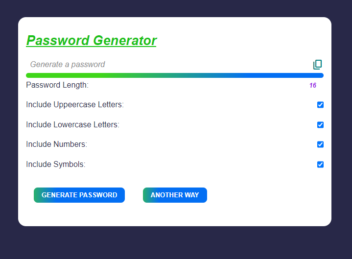

# Random Password Generator

This project is a simple web application that generates random passwords based on user preferences. Users can customize the password length and choose whether to include symbols, numbers, uppercase, and lowercase letters.

## Features

- **Password Length:** Users can specify the desired length of the password.
- **Include Symbols:** Option to include special characters (e.g., `!@#$%^&*()`).
- **Include Numbers:** Option to include numeric digits (0-9).
- **Include Uppercase and Lowercase Letters:** Option to generate passwords with both uppercase (A-Z) and lowercase (a-z) letters.

## How to Use

1. Select the desired password length.
2. Choose whether to include symbols, numbers, uppercase, and lowercase letters.
3. Click the "Generate" button to create a random password.
4. The generated password will be displayed on the screen.

## Technologies Used

- **HTML**: Structure of the user interface.
- **CSS**: Styling of the application.
- **JavaScript**: Logic for generating random passwords based on user input.

